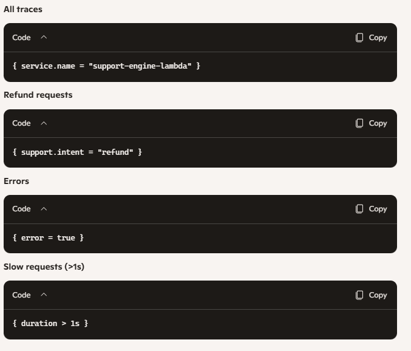

AI‑Powered Customer Support Automation (Make.com → AWS Lambda → Grafana Cloud)
#Overview
This project implements an AI‑powered customer support automation engine that processes incoming customer emails, classifies intent, and returns structured responses, all while providing full observability using OpenTelemetry and Grafana Cloud.

The system is built using:

Make.com — watches Gmail and sends requests to Lambda

AWS Lambda (Python) — processes intents and generates responses

Grafana Cloud Tempo — receives traces via OTLP

Grafana Dashboards — visualizes support activity and performance

This architecture is fully serverless, scalable, and easy to extend.

# System Architecture

                   ┌────────────────────────────┐
                   │        Gmail Inbox          │
                   └──────────────┬─────────────┘
                                  │
                                  ▼
                     (Make.com Scenario Trigger)
                   ┌────────────────────────────┐
                   │   Make.com: Watch Emails   │
                   └──────────────┬─────────────┘
                                  │ Extracts:
                                  │ - sender email
                                  │ - message body
                                  │ - AI intent + fields
                                  ▼
                   ┌────────────────────────────┐
                   │ Make.com → HTTP Module     │
                   │ Sends POST to Lambda URL   │
                   └──────────────┬─────────────┘
                                  │
                                  ▼
                   ┌────────────────────────────┐
                   │     AWS Lambda (Python)    │
                   │  - Parses request           │
                   │  - Routes by intent         │
                   │  - Generates response       │
                   │  - Emits OTLP traces        │
                   └──────────────┬─────────────┘
                                  │
                                  ▼
                   ┌────────────────────────────┐
                   │ Grafana Cloud OTLP Gateway │
                   │ Receives traces            │
                   └──────────────┬─────────────┘
                                  │
                                  ▼
                   ┌────────────────────────────┐
                   │   Grafana Tempo + Explore  │
                   │   - TraceQL queries        │
                   │   - Dashboards             │
                   └────────────────────────────┘
                   

automation Architecture


# Workflow Summary

- Customer sends an email  
  Gmail receives the message.

- Make.com  triggers  
The Watch Emails module extracts:

sender email

message body

AI‑generated intent

fields (order_id, phone, etc.)

- Make.com  sends HTTP POST to Lambda  
The payload looks like:

```
json
{
  "intent": "refund",
  "confidence": 0.92,
  "message": "I want a refund for order 12345",
  "from_email": "customer@example.com",
  "fields": { "order_id": "12345" }
}
```

- Lambda processes the request

Routes by intent

Generates a structured response

Emits OpenTelemetry traces to Grafana Cloud

- Make.com  receives Lambda response

Sends reply email

Or escalates to human support

- Grafana Cloud visualizes everything

Trace list

Intent distribution

Error traces

Latency trends

- Lambda Responsibilities
Parse Make.com  payload

Route by intent:

refund

password_reset

cancel_subscription

account_update

complaint

fallback → escalate

Return structured JSON

- Emit OpenTelemetry traces with attributes:

intent

confidence

email

result status

region

execution time

- OpenTelemetry Setup
Environment variables required:

```
OTEL_EXPORTER_OTLP_ENDPOINT=https://otlp-gateway-eu-west-0.grafana.net/otlp
OTEL_EXPORTER_OTLP_HEADERS=Bearer <your-token>
OTEL_SERVICE_NAME=support-engine-lambda
OTEL_TRACES_SAMPLER=always_on
```
Lambda uses the Python OTLP exporter to send traces directly to Grafana Cloud.

- Grafana Observability
You get:
Live trace feed

Intent‑based panels

Error traces

Slow requests

Latency graphs

Flamegraphs for debugging

- Example TraceQL queries:




- Deployment Steps
1. Create Lambda
Python 3.11

Add your handler code

Add environment variables

Add AWSOpenTelemetryDistroPython layer

2. Create Lambda Function URL
Enable CORS

Copy URL into Make.com

3. Build Make.com Scenario
Watch Gmail

Extract fields

Send HTTP POST to Lambda

Send email reply

4. Configure Grafana Cloud
Use built‑in Tempo data source

Create dashboards

Add TraceQL panels

Business Value
This automation:

Reduces support workload

Responds instantly to common requests

Escalates intelligently

Tracks performance and errors

Provides full observability

Creates a repeatable, scalable support engine

**Author**

Emmanuela
Cloud Architect & DevOps Engineer
GitHub: https://github.com/Cloud-Architect-Emma
